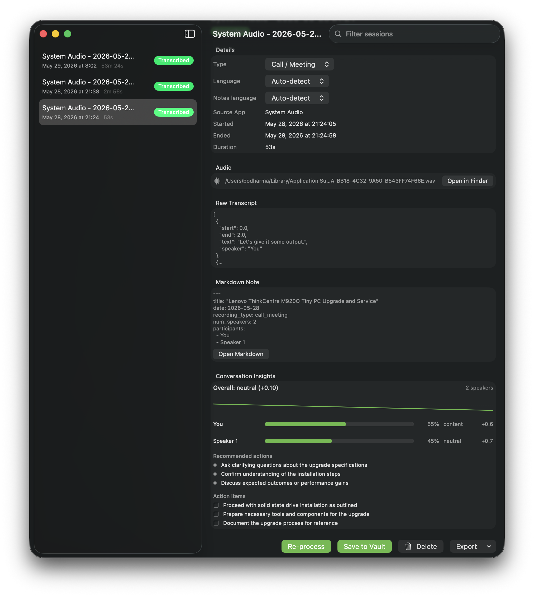
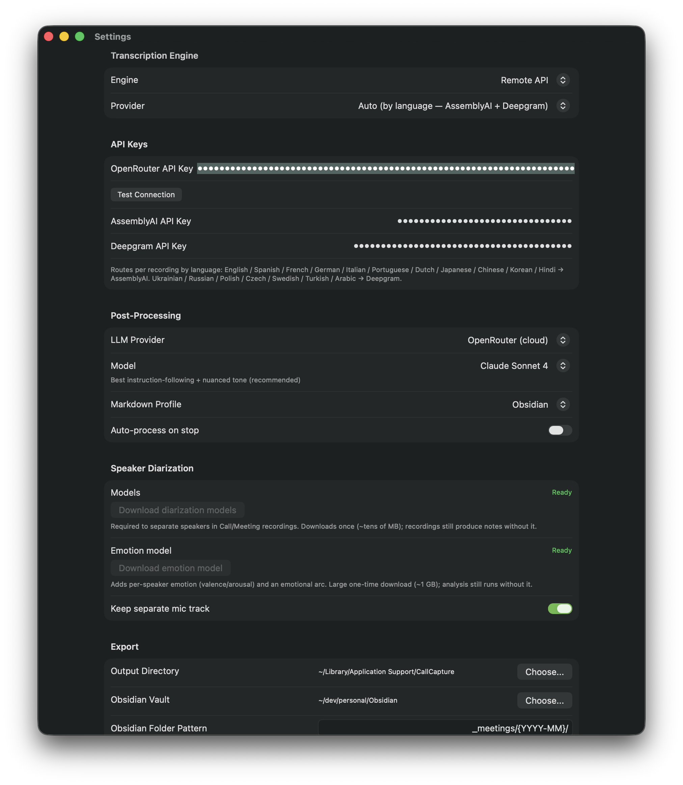

# CallCapture

**Private, local-first call & meeting recording for macOS.** Capture system audio from any call (Google Meet, Zoom, Teams, or anything that plays through your speakers), transcribe it, separate who said what, and turn it into clean Markdown notes — without a bot joining your meeting and without your audio leaving your machine unless you choose a cloud transcription engine.

> A local alternative to Fathom/Otter-style meeting recorders. No meeting bot, no mandatory cloud, no "who invited the notetaker?" — it captures the audio already playing on your Mac.

---

## Why

Hosted meeting recorders join your call as a visible bot and upload everything to their servers. CallCapture instead taps the audio your Mac is already producing (via Core Audio process taps, macOS 14.2+), so:

- **No bot** appears in the meeting.
- **Local by default** — on-device Whisper transcription means audio never leaves your machine. Cloud engines are opt-in.
- **You own the data** — recordings, transcripts, notes, and the session database all live in your local Application Support folder.

## Features

- 🎙️ **System-audio capture** — records call audio via Core Audio process taps; optional microphone capture mixed in.
- 🧑‍🤝‍🧑 **Speaker separation** — captures your mic and the remote side as separate stems and attributes turns with on-device diarization (FluidAudio), so transcripts read *You:* / *Speaker 1:* instead of one wall of text.
- 📝 **Transcription** — on-device **Whisper** (`pywhispercpp`) or cloud engines (**AssemblyAI**, **Deepgram Nova-3**) with automatic per-language routing.
- 🌍 **Multi-language** — broad language support with per-recording spoken language and a separate **output/notes language**.
- 🧠 **Conversation insights** — sentiment, acoustic emotion, key points, and action items via an LLM post-processing pass (OpenRouter or a local model).
- 🗒️ **Markdown notes** — meeting-notes / transcript / Obsidian export profiles, with one-click "Save to Vault."
- 🪶 **Menu-bar app** — lightweight, stays out of the way.

## Screenshots

**Session detail** — transcript with speaker attribution (*You* / *Speaker 1*), the generated Markdown note, and conversation insights (sentiment per speaker, emotional arc, recommended actions, action items):



**Settings** — pick a transcription engine (on-device Whisper or cloud), per-language provider routing, LLM post-processing, on-device diarization & emotion models, and export to an Obsidian vault:



## Architecture

CallCapture is two cooperating pieces:

| Component | Tech | Role |
|-----------|------|------|
| **macOS app** (`macos-app/`) | Swift, SwiftUI, Core Audio, GRDB | Menu-bar UI, audio capture, on-device diarization, session database, settings |
| **Python worker** (`python-worker/`) | Python 3.11+, Pydantic, Click | Transcription + analysis pipeline; invoked per job over stdin/stdout JSON |

The app spawns the worker as a subprocess, sends a `JobRequest` on stdin, and reads progress + a `JobResult` back. See [`docs/DEVELOPMENT.md`](docs/DEVELOPMENT.md) for the full data flow and build instructions.

## Requirements

- macOS **14.2** or later (Core Audio process taps)
- Apple Silicon recommended
- Python **3.11+** (for the worker)
- API keys only if you opt into cloud engines (AssemblyAI / Deepgram for transcription, OpenRouter for LLM notes) — stored in the macOS Keychain, never in the repo.

## Quick start (from source)

```bash
git clone https://github.com/bodharma/callcapture.git
cd callcapture

# Python worker
cd python-worker
python3 -m venv .venv && source .venv/bin/activate
pip install -e ".[dev]"
cd ..

# Build + launch the app in dev mode (builds Swift, bundles, launches)
./run-dev.sh
```

A waveform icon appears in the menu bar. Start a call, hit record, stop, and let it transcribe. Configure engine, languages, API keys, and export folders in **Settings**.

## Privacy

- On-device Whisper keeps audio fully local.
- Cloud engines (AssemblyAI, Deepgram, OpenRouter) upload audio/transcript only when you select them.
- API keys live in the macOS Keychain. Recordings and the session DB stay in `~/Library/Application Support/CallCapture/` and are git-ignored.

## License

[GNU AGPL-3.0](LICENSE) © bodharma. If you run a modified version as a network service, you must release your source.

## Contributing

Issues and PRs welcome. Start with [`docs/DEVELOPMENT.md`](docs/DEVELOPMENT.md) for architecture, build, and test workflows.
